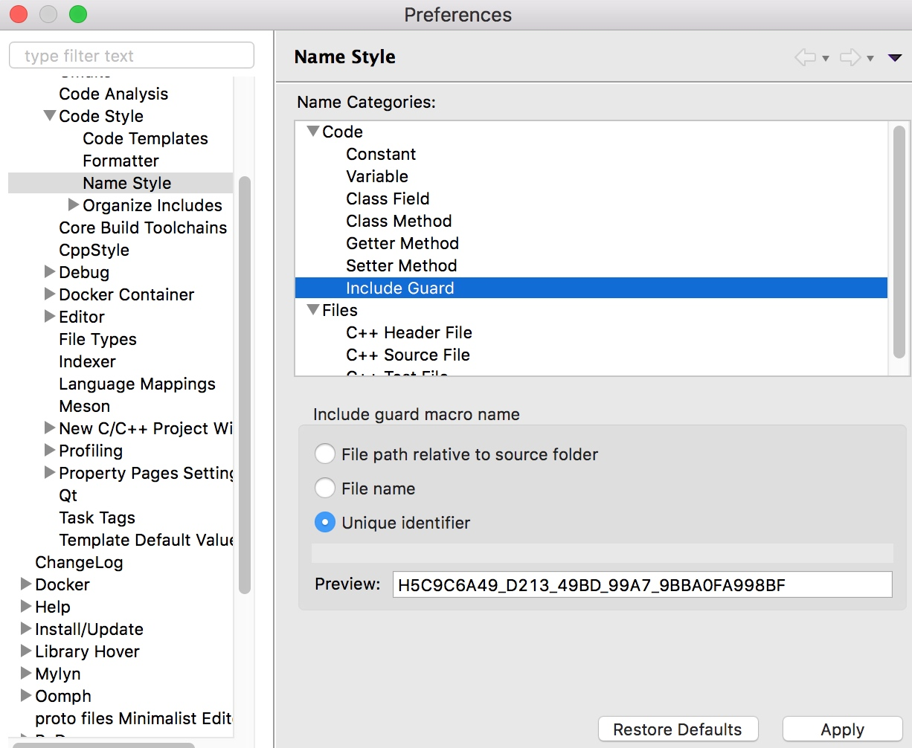

## Clean C++：头文件保护宏

众所周知，每一个头文件都应该具有独一无二的保护宏，以阻止头文件被多次包含。


### 反模式

头文件保护宏具有宏定义的所有缺点，如果名字太短很容易造成冲突。例如，存在如下定义的一个头文件，仅仅使用文件名作为头文件保护宏，冲突的概率极高。

```cpp
#ifndef MUTEX_H
#define MUTEX_H

// ...

#endif
```

### 命名模式：`INCL_<PROJECT>_<MODULE>_<FILE>_H`

使用`INCL_<PROJECT>_<MODULE>_<FILE>_H`的命名模式，可以有效增长宏定义的长度，降低了名字冲突的概率。但是，这样的命名方式存在一个严重的缺陷，当文件名重命名或移动目录时，需要同步修改头文件保护宏，以保持统一性。


```cpp
// cub/concurrent/runnable.h
#ifndef INCL_CUB_CONCURRENT_MUTEX_H
#define INCL_CUB_CONCURRENT_MUTEX_H

// ...

#endif
```

### UUID模式

推荐使用`UUID`命名头文件保护宏，能够有效保证其全局唯一性，而且当重命名或移动目录，都不需要修改该头文件保护宏。

```
#ifndef HA9D6B92F_3916_4AB0_82DD_CE931400B574
#define HA9D6B92F_3916_4AB0_82DD_CE931400B574

// ...

#endif
```

另外，可以通过配置IDE，自动随机地生成UUID，快捷、简单、安全、有效。例如，如下图配置`Eclipse CDT`自动生成UUID风格的头文件保护宏。




