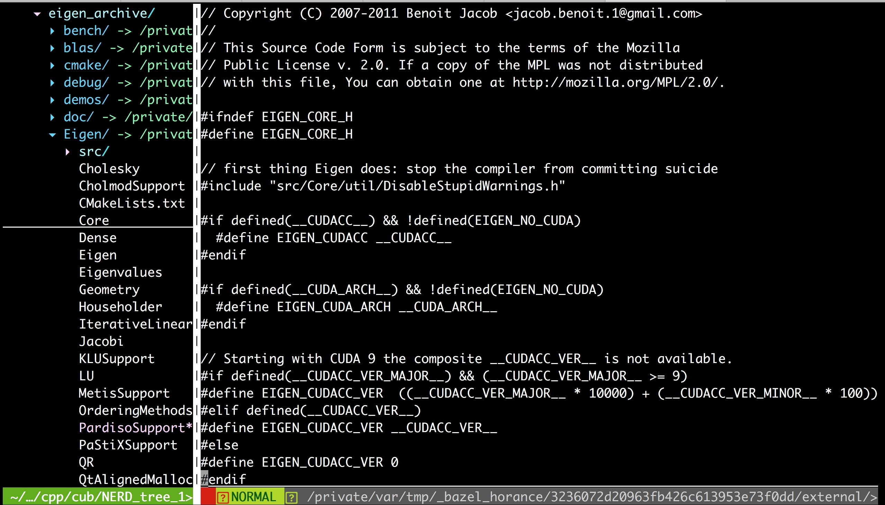

## Clean C++：包含模式

一般地，`#include`用于包含头文件。本文讲述了几类包含模式，包括降低冲突概率的方案，权衡绝对模式与相对模式的利弊，最大的代码可移植性的方法。

### 降低冲突概率

#### 单一模式(反模式)

在大型的`C/C++`项目，`-I`选项可能包含多个搜索路径。如果`#include`仅仅包含单一的文件名，则可能存在冲突的概率。例如，其他子模块也存在一个`mutex.h`的头文件，而且其搜索优先级相对当前目录高，则必然出现冲突。

```cpp
#include "mutex.h"
```

#### 绝对模式(推荐)

推荐使用`#include "project/module/sub_module/file_name.h`的全路径模式，保证其全局唯一性。另外，该模式可以简化和统一配置管理工作，只需将该项目的顶级目录添加至`-I`选项即可。

```cpp
#include "cub/concurrent/mutex.h"
```

> 事实上，`#include`使用的都是相对模式，绝对模式相对于`-I`选项的搜索路径集合。此处，绝对模式指的是始于项目的根目录，不包含相对路径`.`或者`..`的包含风格。

#### 相对模式(反模式)

使用相对模式，使得`#include`的包含风格缺乏统一性，而且使得人难以理解。移动目录时，重构相应的`#include`语句相对更容易出错。

```cpp
#include "./mutex.h"
#include "../fs/uri.h"
```

### 最大化移植性

#### 分隔符

包含头文件时，路径分隔符一律使用Unix风格，拒绝使用Windows风格；即采用`/`分割路径，而不是使用`\`。使用Unix风格的分隔符，程序具有最大的可移植性，而采用Windows风格的`\`，只能在`Windows`生态的编译器上编译代码。

##### Windows风格(反模式)

```cpp
#include "cut\core\synchronized_object.h"
```

##### Unix风格(推荐)

```cpp
#include "cut/core/synchronized_object.h"
```

#### 大小写

`Windows`生态中的编译器往往对大小写不敏感，而`Windows`生态中的编译器则对大小写是敏感的，这是两个生态不同的价值观导致的分歧。为了最大化可移植性，`#include`的路径名和文件名一律大小写。

##### 驼峰风格(反模式)

```cpp
// 路径名、文件名使用大写
#include "CUT/Core/SynchronizedObject.h"
#include "CUT/YAMLParser/Syntax.h"
```

##### 一律小写(推荐)

```cpp
// 路径名、文件名使用小写
#include "cut/core/synchronized_object.h"
#include "cut/yaml_parser/syntax.h"
```

但是，文件中的主体类名`SynchronizedObject`与之小写的文件名存在两种不同的命名风格。幸运的是，主流IDE重命名文件名或类名时，两者能够保持一致。

### 约定优于配置

统一风格，可以使代码更加优美和对称。项目中坚持使用绝对模式的单一风格，可以极大地降低编译器的配置管理工作，使得团队成员更容易达成一致的默契，也利于团队和团队之间保持一致价值观。相反地，每个开发者，或每个团队都存在各自的个性和风格，对整个公司或产品是极为不利的。

#### <> 与 ""

社区对于两种风格，争论从未停止，存在两种风格。

- 一律使用`<>`；
- 标准库使用`<>`，其他使用`""`。

前者优势在于统一，程序员不用动脑；后者在于显式的区分，而且社区接受程度高。两者各有优缺点，最关键的是选择一种风格，并一如既往的坚持最初的决定。

> 我更倾向于标准库使用`<>`，自定义使用`""`。

#### 后缀名

理论上，`#include`可以包含任何的文本文件、头文件使用`h, hpp, hxx`等后缀，实现文件使用`cc, cpp, cxx`等后缀名。一致的后缀名，可以极大地降低编译器的配置管理工作。要么`h, cc`, 要么`h, cpp`；不可`h, hpp; cpp, cc`混合搭配。

如果自定义的头文件没有后缀名，这是愚蠢的做法。该风格被标准库保留，自定义的头文件将极大概率与现有或未来的标准库存在冲突，而且会违背社区的主流的习惯和约定。例如，著名的`Eigen`库就是一种典型的反模式，我手中的所有IDE或编辑器(下图是vi编辑器)，其代码着色功能全部失效，给代码的阅读和维护造成了很大的障碍。

为了能够在Eclipse CDT中恢复这些没有后缀头文件的代码着色功能，`Eigen`在官方文档中给出了一套配置方法。可以想象，违背“约定由于配置”的原则，不仅给客户带来麻烦，也给自己带来了不必要的负担。




