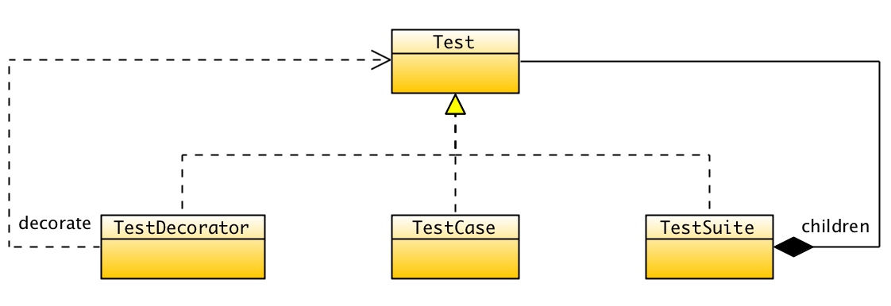

## Clean C++：私有化覆写的虚函数

在`C++11`中增加了`override`的关键字，当子类需要覆写基类的虚函数时，提供显式的`override`，可以有效改善程序的编译时安全。

### 编译时安全

例如，存在一个基类`Test`，它声明了`2`个抽象方法。

```cpp
struct TestResult;

struct Test {
  virtual void run(TestResult&) = 0;
  virtual int countTestCases() const = 0;

  virtual ~Test() {}
};
```

在子类中覆写基类抽象方法时，显式地标注`override`不仅可以增强代码的可读性，而且可以增强编译时的安全性。如果严格遵循该规则，当重构基类的抽象方法的签名时，编译器可以准确地找到所有编译失败的引用点，提供了绝佳的重构防护作用。

```cpp
#include "cut/core/test.h"

struct TestDecorator : Test { 
  TestDecorator(Test& test);

private: 
  void run(TestResult&) override;
  int countTestCases() const override;

private:
  Test& test; 
};
```

### 按接口编程

「按接口编程」是面向对象的重要原则。遵循该原则，可以做到模块之间的解耦合，使得两个变化的方向保持独立。而在C++语言中，访问控制和多态覆写行为是分离的，子类是可以覆写父类私有的虚函数的。例如，模板方法的模式的典型实现方法，都是覆写基类的私有的虚函数实现的。

私有化覆写的虚函数，可以有效保证用户错误地调用子类的成员函数，并明确告诉用户应该基于抽象的接口类型实施编程。例如，上例`TestDecorator`的构造函数必须公开，否则该类型的实例就不可构造了。其覆写的所有虚函数都被声明为`private`，警示用户应该基于`Test`在运行时多态地调用相应的抽象方法。

### TestSuite: Test实例集的仓库实现

#### 头文件定义

以`TestSuite`为例，它持有一系列`Test`类型的实例，它们的运行时类型可能是`TestCase, TestSuite, TestDecorator`等等。基于抽象的`Test`类型，实现用例集的隐式树型结构。

```cpp
#include "cut/core/test.h"
#include "cut/core/internal/bare_test_suite.h"
#include <vector>

struct TestSuite : Test, private BareTestSuite {
  ~TestSuite();

  void add(Test* test);

private:
  void run(TestResult& result) override;
  int countTestCases() const override;

private:
  const Test& get() const override;
  void runBare(TestResult& result) override;

private:
  std::vector<Test*> tests;
};
```

#### 实现文件

`TestSuite`在实现析构函数及其其他函数时，都是基于`Test`的抽象类型实现运行时多态调用的。

```cpp
#include "cut/core/test_suite.h"
#include "cub/base/algo.h"

void TestSuite::add(Test* test) {
  tests.push_back(test);
}

TestSuite::~TestSuite() {
  for (auto test : tests) {
    delete test;
  }
}

int TestSuite::countTestCases() const {
  static auto accumulator = [](Test* test){
    return test->countTestCases();
  };
  return cub::reduce(tests, 0, accumulator);
}

const Test& TestSuite::get() const {
  return *this;
}

void TestSuite::runBare(TestResult& result) {
  for (auto test : tests) {
    test->run(result);
  }
}

void TestSuite::run(TestResult& result) {
  result.runTestSuite(*this);
}
```

`Test, TestSuite, TestCase, TestDecorator`之间的关系如下图所示。



