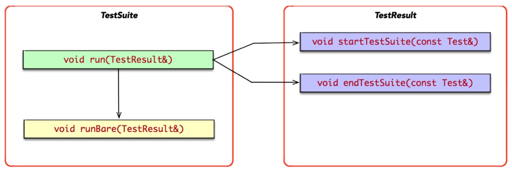
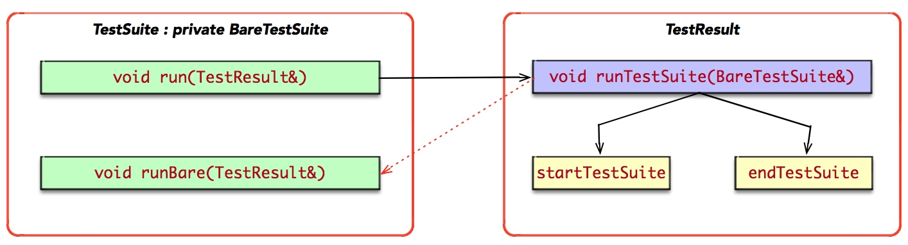
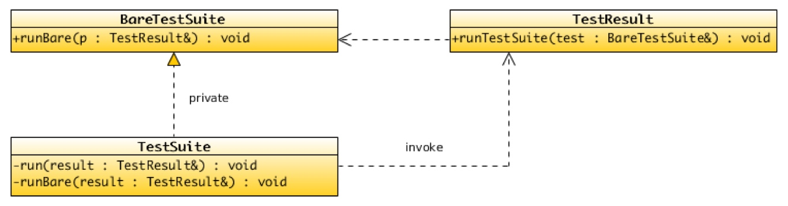

## Clean C++：使用私有继承解耦合

在`xUnit`实现模式中，存在`TestCase, TestSuite, TestResult, TestListener, TestMethod`等重要领域对象。

### 重构之前

在我实现`Cut`的最初的版本中，`TestSuite`与`TestResult`之间的关系是紧耦合的，并且它们的职责分配也不合理。

> [Cut](https://github.com/horance-liu/cut)是一个使用Modern C++实现的xUnit框架。

#### TestSuite: 持有Test实例集的仓库

`TestSuite`是一个持有`Test`实例列表的仓库，它持有`std::vector<Test*>`类型的实例集。它实现了`Test`接口，并覆写了`run`虚函数。此外，在实现`run`时，提取了一个私有函数`runBare`。

```cpp
// cut/core/test_suite.h
#include <vector>
#include "cut/core/test.h"

struct TestSuite : Test {
  ~TestSuite();
  
  void add(Test* test);

private:
  void run(TestResult& result) override;

private:
  void runBare(TestResult& result);

private:
  std::vector<Test*> tests;
};
```

`TestSuite`维护了`Test`实例的生命周期，初始时为空，并通过`add`接口添加`Test`类型的动态实例；最后，通过析构函数回收所有的`Test`实例。

```
void TestSuite::add(Test* test) {
  tests.push_back(test);
}

TestSuite::~TestSuite() {
  for (auto test : tests) {
    delete test;
  }
}

inline void TestSuite::runBare(TestResult& result) {
  for (auto test : tests) {
    test->run(result);
  }
}

void TestSuite::run(TestResult& result) {
  result.startTestSuite(*this);
  runBare(result);
  result.endTestSuite(*this);
}
```

#### TestResult: 测试结果的收集器

`TestResult`的职责非常简单，作为`Test`的聚集参数。它持有`TestListener`实例集，当测试执行至关键阶段，将测试的状态和事件通知给`TestListener`。`TestListener`监听`TestResult`的状态变化，通过定制和扩展实现测试数据统计、测试进度上报、测试报表生成等特性。

```cpp
struct TestResult { 
  ~TestResult();
  
  void add(TestListener*);

  void startTestSuite(const Test& test);
  void endTestSuite(const Test& test);  

private:
  template <typename Action>
  void boardcast();

private:
  std::vector<TestListener*> listeners; 
};
```

`TestResult`维护了`TestListener`实例集的生命周期。初始时该集合空，通过`add`接口添加`TestListener`类型的动态实例；最后，通过析构函数回收所有的`TestListener`实例。

另外，`TestResult`为`TestSuite`公开了两个事件处理接口`startTestSuite, endTestSuite`。需要特别注意的是，私有的函数模板`boardcast`并没有在头文件中实现，它在实现文件中内联实现，其消除了重复的迭代逻辑。

```cpp
template <typename Action>
inline void TestResult::boardcast(Action action) {
  for (auto listener : listeners) {
    action(listener);
  }
}

TestResult::~TestResult() {
  boardcast([](auto listener) {
    delete listener;
  });
}

void TestResult::add(TestListener* listener) {
  listeners.push_back(listener);
}

void TestResult::startTestSuite(const Test& test) {
  boardcast([&test](auto listener) {
    listener->startTestSuite(test);
  });
}

void TestResult::endTestSuite(const Test& test) {
  boardcast([&test](auto listener) {
    listener->endTestSuite(test);
  });
}
```

#### 职责分布不合理

如下图所示，`TestSuite::run`方法依赖于`TestResult`的两个公开成员函数`startTestSuite, endTestSuite`。



观察`TestSuite::run`的实现逻辑，其与`TestResult`关系更加紧密。因为，`TestSuite::run`调用`TestSuite::runBare`前后两个语句分别调用了`TestResult`的两个成员函数`TestResult::startTestSuite, TestResult::endTestSuite`完成的。与之相反，`TestSuite::runBare`则与`TestSuite`更加紧密，因为它需要遍历私有数据成员`tests`。

据此推论，`TestSuite::run`的实现逻辑与`TestResult`关系更加密切，应该将相应的代码搬迁至`TestResult`。难点就在于，`runBare`在中间，而且又与`TestSuite`更为亲密，这给重构带来了挑战。

### 应用迪米特法则

既然`TestSuite::run`的实现逻辑相对于`TestResult`更加紧密，应该将其搬迁至`TestResult`。经过重构，`TestResult`公开给`TestSuite`唯一的接口为`runTestSuite`，而将`startTestSuite, endTestSuite`私有化了。

```cpp
struct TestResult {
  // ...
  
  void runTestSuite(TestSuite&);

private:
  void startTestSuite(const Test& test);
  void endTestSuite(const Test& test);  

private:
  std::vector<TestListener*> listeners; 
};

void TestResult::runTestSuite(TestSuite& suite) {
  startTestSuite(suite);
  suite.runBare(*this);
  endTestSuite(suite);
}
```

不幸的是，`TestSuite`也因此必须公开`runBare`接口。

```cpp
struct TestSuite : Test {
  // ...
  
  void runBare(TestResult& result);  
  
private:
  void run(TestResult& result) override;
  
private:
  std::vector<Test*> tests;
}

void TestSuite::runBare(TestResult& result) {
  for(auto test : tests) {
    test->run(result);
  }
}

void TestSuite::run(TestResult& result) {
  result.runTestSuite(*this);
}

// ...
```

经过一轮重构，`TestSuite`虽然仅仅依赖于`TestResult::runTestSuite`一个公开接口，但`TestResult`也反向依赖于`TestSuite::runBare`，依赖关系反而变成双向依赖，两者之间的耦合关系更加紧密了。

但本轮重构是具有意义的，经过重构使得`TestSuite`与`TestResult`的职责分布更加合理，唯一存在的问题就是两者之间依然保持紧耦合的坏味道。

### 解耦合

#### 关键抽象

`TestSuite`与`TestResult`之间相互依赖，可以引入一个抽象的接口`BareTestSuite`，两者都依赖于一个抽象的`BareTestSuite`，使其两者之间可以独立变化，消除`TestResult`对`TestSuite`的反向依赖。

```cpp
struct BareTestSuite {
  virtual const Test& get() const = 0;
  virtual void runBare(TestResult&) = 0;

  virtual ~BareTestSuite() {}
};
```

#### 私有继承

`TestSuite`私有继承于`BareTestSuite`，在调用`TestSuite::run`时，将`*this`作为`BareTestSuite`的实例传递给`TestResult::runTestSuite`成员函数。

```cpp
struct TestSuite : Test, private BareTestSuite {
  // ...
  
private:
  void run(TestResult& result) override;

private:
  const Test& get() const override;
  void runBare(TestResult& result) override;

private:
  std::vector<Test*> tests;
};

void TestSuite::runBare(TestResult& result) {
  foreach([&result](Test* test) {
    test->run(result);
  });
}

const Test& TestSuite::get() const {
  return *this;
}

// !!! TestSuite as bastard of BareTestSuite.
void TestSuite::run(TestResult& result) {
  result.runTestSuite(*this);
}
```

通过私有继承，`TestSuite`作为`BareTestSuite`的私生子，传递给`TestResult::runTestSuite`成员函数，而`TestResult::runTestSuite`使用抽象的`BareTestSuite`接口，满足李氏替换，接口隔离，倒置依赖的基本原则，实现与`TestSuite`的解耦。

#### 反向回调

重构`TestResult::runTestSuite`的参数类型，使其依赖于抽象的、更加稳定的`BareTestSuite`，而非具体的、相对不稳定的`TestSuite`。

```cpp
struct TestResult {
  // ...
  
  void runTestSuite(BareTestSuite&);
  
private:
  std::vector<TestListener*> listeners;  
};

#define BOARDCAST(action) \
  for (auto listener : listeners) listener->action

void TestResult::runTestSuite(BareTestSuite& test) {
  BOARDCAST(startTestSuite(test.get()));
  test.runBare(*this);
  BOARDCAST(endTestSuite(test.get()));
}
```

而在实现`TestResult::runTestSuite`中，通过调用`BareTestSuite::runBare`，将在运行时反向回调`TestSuite::runBare`，实现多态调用。关键在于，反向回调的目的地，`TestResult`是无法感知的，这个效果便是我们苦苦追求的解耦合。

另外，此处使用宏函数替换上述的模板函数，不仅消除了模板函数的复杂度，而且提高了表达力。教条式地摒弃所有宏函数，显然是不理智的。关键在于，面临实际问题时，思考方案是否足够简单，是否足够安全，需要综合权衡和慎重选择。

> 其持之有故，其言之成理；适当打破陈规，不为一件好事。所谓“守破离”，软件设计本质是一门艺术，而非科学。

### 重构分析

经过重构，既有的`TestSuite::run`职责搬迁至`TestResult::runTestSuite`。一方面，`TestResult`暴露给`TestSuite`接口由`2`减少至`1`，缓解了`TestSuite`对`TestResult`的依赖关系。另一方面， 私有化了`TestResult::startTestSuite`, `TestResult::endTestSuite`成员函数，使得`TestResult`取得了更好的封装特性。通过重构，职责分配达到较为合理的状态了。



解耦的关键在于抽象接口`BareTestSuite`，在没有破坏`TestSuite`既有封装特性的前提下,此时`TestResult`完全没有感知`TestSuite, TestCase`存在的能力，所以解除了`TestResult`对`TestSuite, TestCase`的反向依赖。

相反，`TestSuite, TestCase`则依赖于`TestResult`的。其一，单向依赖的复杂度是可以被控制的；其二，`TestResult`作为`Test::run`的聚集参数，它充当了整个`xUnit`框架的大动脉和神经中枢。

按照正交设计的理论，通过抽象的`BareTestSuite`解除了`TestResult`对`TestSuite`的反向依赖关系，使得`TestResult`依赖于更加稳定的抽象，缩小了所依赖的范围。



